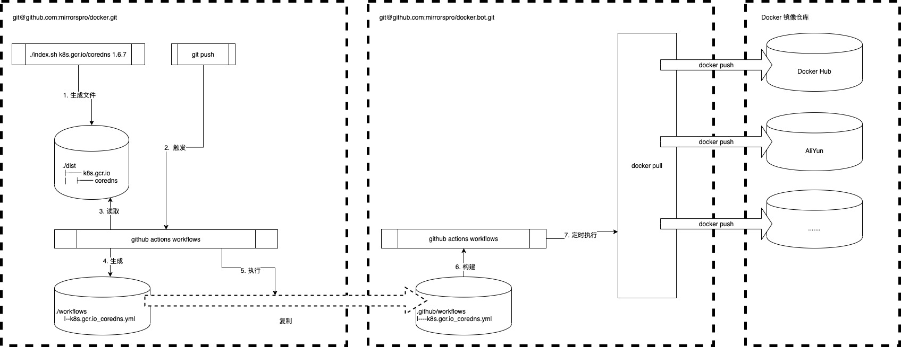

# docker 镜像搬运工
镜像搬运工，用于解决在跨网络的场景下，难以获取镜像的问题

## 它是如何工作的




https://github.com/mirrorspro/docker.bot.git

## 我要怎样使用

* 新增一个要同步的docker镜像库源


```bash

./index.sh quay.io/kubernetes-ingress-controller/nginx-ingress-controller 0.32.0

```

* 生成镜像索引配置后，提交到github

```bash

git add -A ./dist && git commit -m "新增源镜像" && git push

```

* 确认镜像已经成功提交到边缘仓库

e.g. 

https://hub.docker.com/orgs/mirrorspro

命名格式：

源 `quay.io/kubernetes-ingress-controller/nginx-ingress-controller:0.32.0`

--（`/`被替换为`_`）-->

目标 `mirrorspro/quay.io_kubernetes-ingress-controller_nginx-ingress-controller:0.32.0`


* 在业务机器本地使用镜像

```bash

// from docker hub
./pull.sh quay.io/kubernetes-ingress-controller/nginx-ingress-controller 0.32.0

// from registry.cn-shenzhen.aliyuncs.com 
./pull.sh quay.io/kubernetes-ingress-controller/nginx-ingress-controller 0.32.0 registry.cn-shenzhen.aliyuncs.com

```


